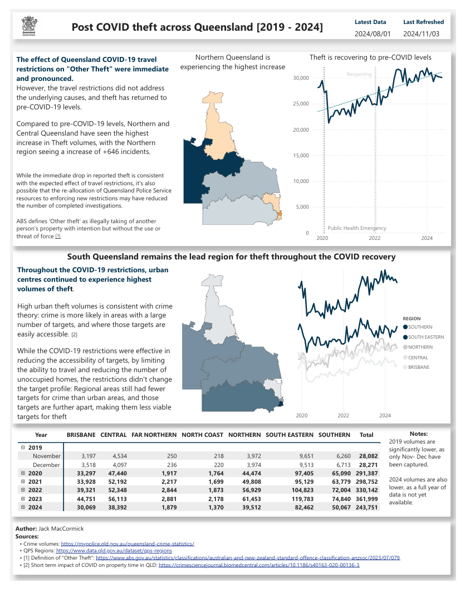
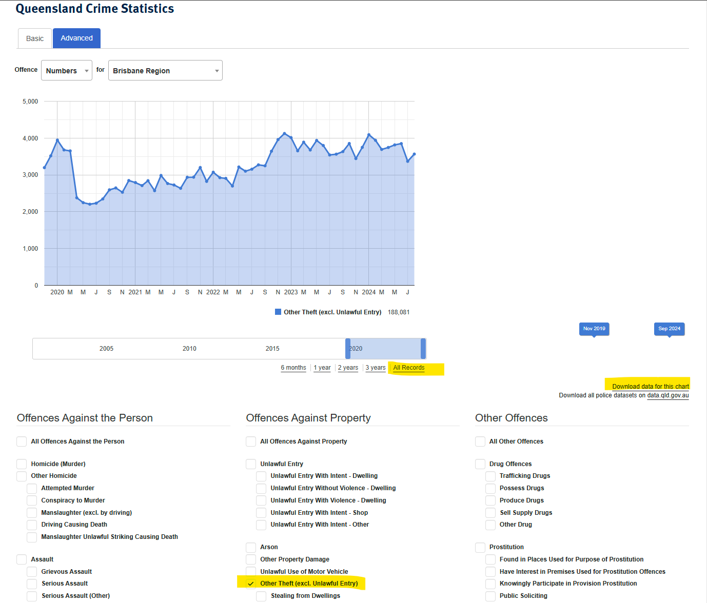
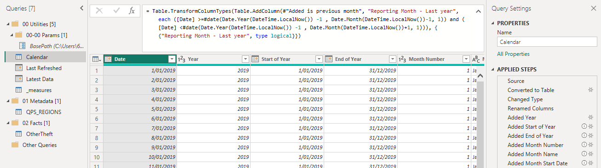
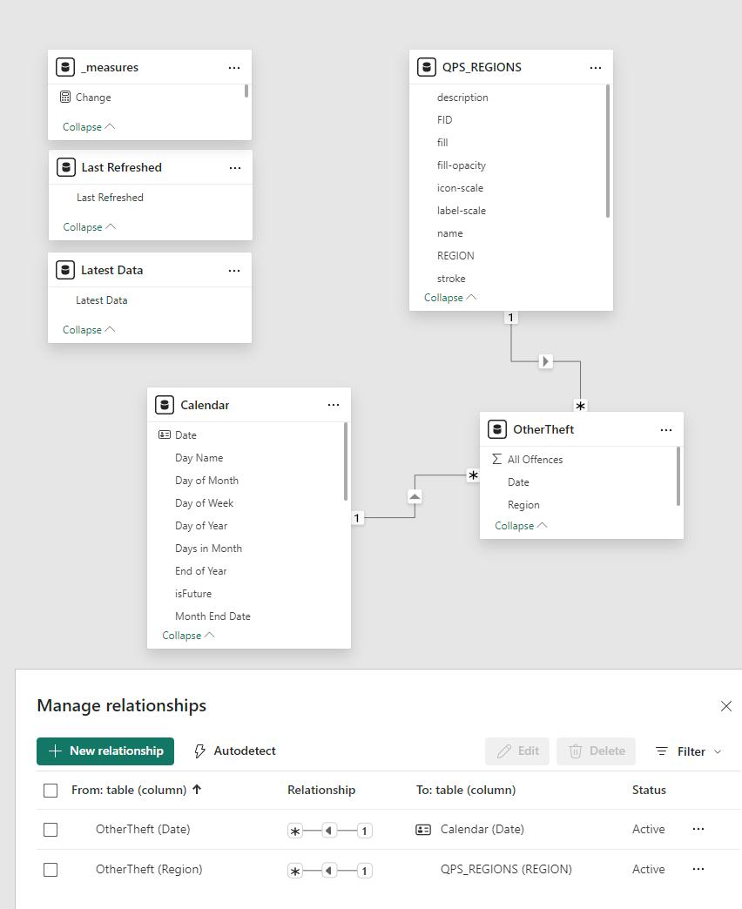

# AO7 Principal Data Analyst Interview Practical 

## Purpose: Demonstrate the ability to produce data visualisations and commentary around a selected crime trend, based on QPS data
Selected analysis is the impact of the Queensland COVID-19 travel restrictions on "Other Theft", aka Theft without threat or use of violence.

Connects directly to data downloaded from QPS's [interactive data visualisation tool](https://mypolice.qld.gov.au/queensland-crime-statistics), as [data.qld.gov](https://www.data.qld.gov.au/dataset?q=crime%20statistics&sort=score%20desc%2C%20metadata_modified%20desc) does not have corresponding regional crime data 2024. 

## Datasets
### Queensland Police Service (QPS)
1. Queensland Crime Statistics - Advanced
    Link: https://mypolice.qld.gov.au/queensland-crime-statistics/
    Filters:
    - Offence type: `Other Theft (excl. Unlawful Entry)`
    - Date range: `[2019-11-01, 2024-09-30]`
2. QPS Regions: Geographic data
    Link: https://www.data.qld.gov.au/dataset/qps-regions
    Filters: None
### PowerBI
- Calendar

## Measures and Calculations
Measure   | Defintion
----------|---------------
Change    | Post COVID volume - Pre-COVID restriction volume   `Offences(Aug24) - Offences(Jan2020)`
Offences  | Sum of offence count, by region by month
Last refreshed  | Last time PowerBI checked for new data
Latest data | Date of most recent data point

## Pages
Index | Display | Configuration
-------|--------|--------------
Interface |  | 
Data Model |  | 

## Tools:
- [Filled Shape tutorial PowerBI](https://servian.dev/power-bi-custom-maps-part-ii-shape-map-939873da3f66)
- [GeoJSON tool](https://mapshaper.org/)